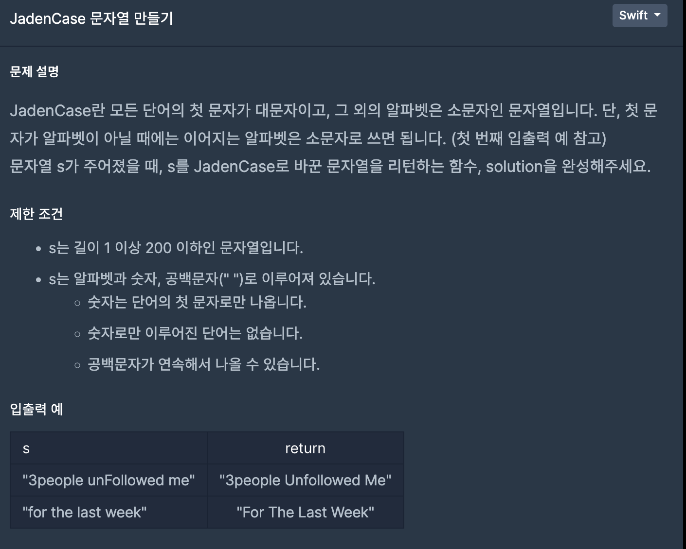
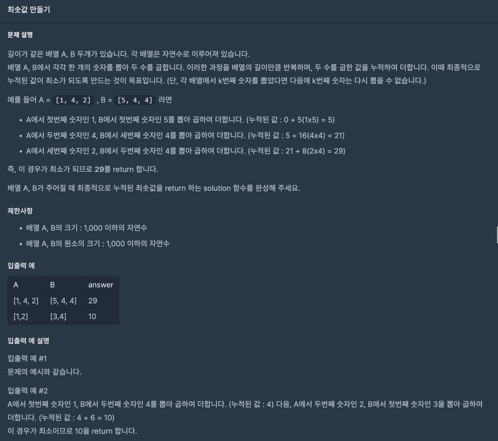
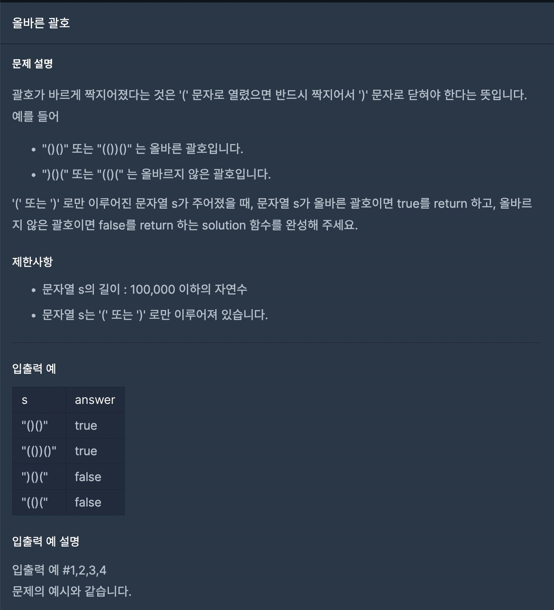

<br/>

---

### 01. JadenCase 문자열 만들기

&nbsp;&nbsp;&nbsp;&nbsp;<br/>


```Swift
func solution(_ s: String) -> String {
    var shouldCapitalize = true
    return s.lowercased().map { char -> String in
        if char == " " {
            shouldCapitalize = true
            return String(char)
        } else if shouldCapitalize {
            shouldCapitalize = false
            return String(char).uppercased()
        } else  {
            return String(char)
        }
    }.joined()
}
```

1. 음절(?)의 첫단어만 대문자로 바꿔주면 되기 때문에 flag를 통해 문자열을 바꿔준다.
2. 만약 문자열이 한 번 대문자로 바뀌면 flag를 false로 해줘서 나머지 문자열은 그냥 통과시킨다.
3. 빈문자열(띄어쓰기)가 오면 flag를 true로 바꿔준다.
4. String 이외의 정수같은 녀석들은 전부 마지막 else문을 통과시켜준다

#

### 02. 최솟값 만들기

&nbsp;&nbsp;&nbsp;&nbsp;<br/>

```Swift
import Foundation

func solution(_ A:[Int], _ B:[Int]) -> Int
{
    let sortedA = A.sorted()
    let sortedB = B.sorted(by: >)
    
    return zip(sortedA, sortedB).map(*).reduce(0, +)
}
```

1. 곱한수의 최솟값을 만들기 위해서는 기본적으로 가장 작은수와 큰수를 곱해주어야한다.
2. A배열은 오름차순으로, B배열은 내림차순으로 정리해준뒤 곱해서 더해주면 되는 부분이다.
3. 코드의 간결함을 위해 고차함수를 사용해보았디.

#

### 03. 올바른 괄호

&nbsp;&nbsp;&nbsp;&nbsp;<br/>

```Swift
import Foundation

func solution(_ s:String) -> Bool
{
    var ac = 0
    
    guard s.first == "(" else { return false }    
    for i in s {
        if i == "(" {
            ac += 1
        } else {
            ac -= 1
             if ac < 0 {
                return false
            }
        }  
    }
    
    if ac == 0 {
        return true
    } 
    
    return false
}
```

1. 처음에 )가 먼저오면 false를 리턴해준다
2. ( 이 나오면 ac +=1 을 하고 )이 나오면 ac -= 1 을 한다
3. 만약 중간에 ac가 음수가 되면 바로 false를 리턴한다
4. 마지막에 괄호가 제대로 닫혔는지 ac == 0인지 확인해주고 맞다면 true 리턴한다

#

#### 조금 더 개선된 답안 (스택 이용)

``` swift
import Foundation

func solution(_ s:String) -> Bool
{
    var stack: [Character] = []

    for char in s {
        if char == "(" {
            stack.append(char)
        } else if char == ")" {
            if stack.isEmpty {
                return false
            }
            stack.removeLast()
        }
    }

    return stack.isEmpty
}
```
위의 방법과 비슷하지만 딕셔너리를 통해 스택구조로 문제를 다시 풀어 보았다
   
